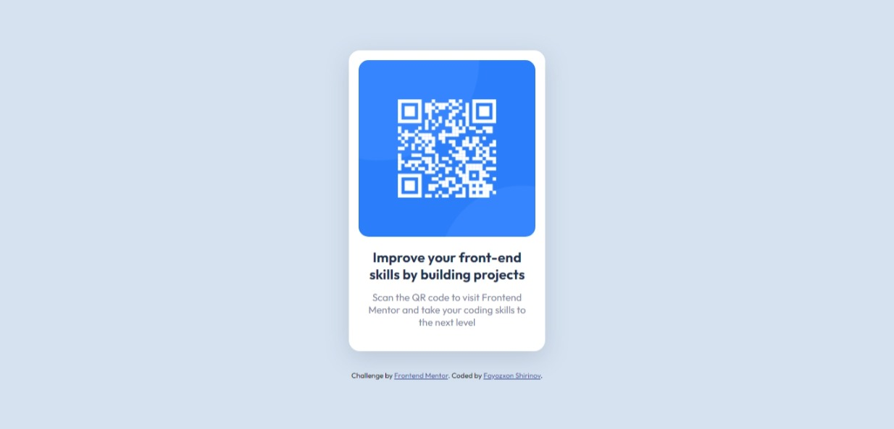

# Frontend Mentor - QR code component solution

This is a solution to the [QR code component challenge on Frontend Mentor](https://www.frontendmentor.io/challenges/qr-code-component-iux_sIO_H). Frontend Mentor challenges help you improve your coding skills by building realistic projects. 

## Table of contents

- [Overview](#overview)
  - [Screenshot](#screenshot)
  - [Links](#links)
- [My process](#my-process)
  - [Built with](#built-with)
- [Author](#author)

## Overview

### Screenshot

### Links

- Solution URL: [Solution on Github](https://https://github.com/Fayozxon/QR-Code-Component-FrontEndMentor.com)
- Live Site URL: [QR Code Component](https://https://qr-code-mentor.netlify.app/.com)

## My process

### Built with

- Semantic HTML5 markup
- CSS custom properties
- Google Fonts
- Flexbox

## Author

- Frontend Mentor - [@fayozxon](https://www.frontendmentor.io/profile/Fayozxon)
- GitHub - [@fayozxon](https://www.github.com/Fayozxon)
